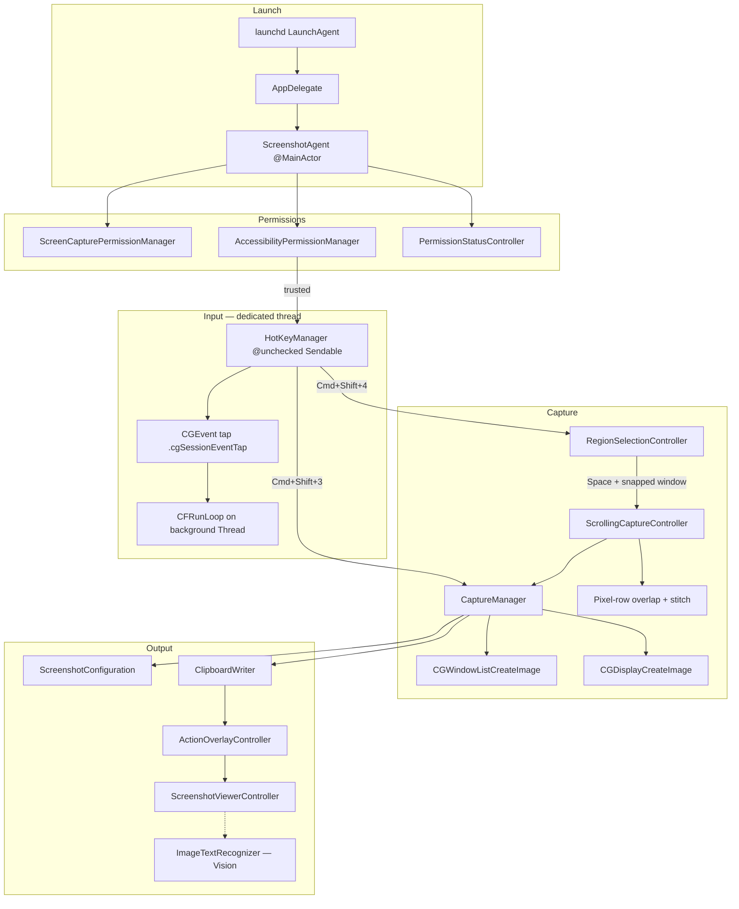

# SSClipboard

**A headless macOS screenshot agent** that intercepts `Cmd+Shift+3` / `Cmd+Shift+4`, runs a custom capture pipeline (save → clipboard → optional UI), and adds **scroll-stitch capture** — with no Dock icon and no extra paste step.

Built as a **Swift 6** Swift Package Manager executable (no Xcode project), distributed as a code-signed `.app` bundle, and launched at login via **`launchd`**. Global shortcuts are handled by a **`CGEvent` session tap on a dedicated background thread**; UI and orchestration stay on **`@MainActor`**.

---

## Problem

macOS screenshots are fast, but the default flow still adds friction: mentally tracking save location, opening Preview or Finder, copying again for chat or docs, and no first-party **tall-content / scroll-stitch** capture. SSClipboard keeps familiar shortcuts while routing every successful capture to the clipboard immediately and layering a custom post-capture surface (transient overlay + full viewer) that Apple does not expose through public screenshot APIs.

---

## Engineering highlights

| Area | What the code does |
|------|-------------------|
| **Global input** | `CGEvent.tapCreate` at `.cgSessionEventTap` / `.headInsertEventTap` on thread `com.rishi.ssclipboard.eventtap` with its own `CFRunLoop` — tap callbacks never block the main run loop |
| **Swift 6 concurrency** | `swiftLanguageModes: [.v6]`; capture orchestration and AppKit UI on `@MainActor`; `HotKeyManager` is `@unchecked Sendable` with `@Sendable` closures across threads |
| **Scroll stitching** | `ScrollingCaptureController` samples `CGWindowListCreateImage` on a ~0.18s timer and drops paused (duplicate) frames; `ScrollingStitcher` detects the non-scrolling top/bottom **chrome bands**, aligns only the middle **content band** across frames via full-width row correlation (handles up- and down-scroll), then composes chrome-once + stitched content into one bitmap |
| **Multi-display** | Full-screen path unions `NSScreen` frames and blits each display via `CGDisplayCreateImage` onto one canvas |
| **Coordinate systems** | AppKit (bottom-left) ↔ Quartz (top-left) Y-flip for overlay drawing, window hit-testing, and `CGWindowListCreateImage` rects |
| **Window polish** | Layer-0 hit test via `CGWindowListCopyWindowInfo`; 12pt rounded-corner alpha mask on window captures |
| **Viewer tools** | `ImageTextRecognizer` — on-device Vision OCR with **Copy Text** in the viewer; `ImageRedactionEditor` — drag regions to blur or solid-fill sensitive areas |
| **Ops** | `os.Logger` categories (`SSCLog`); menu-bar permission status (`PermissionStatusController`) with System Settings deep links; `AppSettings` UserDefaults suite; delete-to-trash with **8s undo** in the action overlay |

---

## Features

- **Instant clipboard** — every successful capture is written to `NSPasteboard` before the user moves on (`ClipboardWriter`)
- **Full-screen (`Cmd+Shift+3`)** — composites all displays onto one `CGImage`
- **Region / window (`Cmd+Shift+4`)** — borderless multi-display overlay (`.screenSaver` level); software crosshair; hover to snap a window (blue highlight); drag for manual region; AppKit ↔ Quartz coordinate conversion
- **Scrolling capture** — snap a window, **Space** to start scroll recording, scroll the target content (Space/page-down works in the target app), **Return** or **Esc** to stop; frames are stitched into one tall image, then saved and copied
- **Native save location** — reads `com.apple.screencapture` for folder and format (PNG / JPEG / TIFF / HEIC, etc.) via `ScreenshotConfiguration`
- **Transient action overlay** — bottom-right panel (default ~6s, configurable via `AppSettings`) with Share, Delete, and draggable preview; click preview to open the viewer
- **Full-screen viewer** — zoom, copy, share, reveal in Finder, delete; window captures expose a **background editor** (gradient / solid, padding, aspect presets 1:1, 4:3, 16:9, 3:2)
- **Copy text (OCR)** — viewer toolbar runs `VNRecognizeTextRequest` and copies recognized text to the clipboard
- **Redact / blur** — drag one or more regions in the viewer; apply Gaussian blur or solid black, then save back to disk
- **Permission UX** — Screen Recording + Accessibility prompts at launch; menu-bar status item with deep links to System Settings when permissions are missing
- **Login agent** — `RunAtLoad` + `KeepAlive` via `launchd`

### Scrolling capture workflow

| Step | Action |
|------|--------|
| 1 | `Cmd+Shift+4` — region overlay appears across all displays |
| 2 | Move over a scrollable window until it highlights (**blue**); click for a normal window shot, or press **Space** while snapped to enter scroll mode (**green**) and start recording |
| 3 | Scroll the window content; frames sample on a timer while pixels change (static frames are skipped) |
| 4 | **Return** or **Esc** — stop recording, stitch overlaps, save, copy to clipboard, show action overlay |
| — | **Escape** — cancel during region selection; also ends scroll recording (handled by the same global key interceptor) |

A HUD (*Recording — Return or Esc to stop*) appears in the bottom-right while scroll capture is active.

> **Tip:** Rebind or disable macOS’s built-in screenshot shortcuts so SSClipboard can own `Cmd+Shift+3/4`: **System Settings → Keyboard → Keyboard Shortcuts → Screenshots**.

---

## Architecture



### Module map

```
Sources/ssclipboard/
├── main.swift                         # NSApplication, .prohibited activation policy
├── AppDelegate.swift                  # Boots ScreenshotAgent
├── ScreenshotAgent.swift              # Coordinator: permissions, hotkeys, capture, scroll HUD
├── HotKeyManager.swift                # CGEvent tap on dedicated thread; keyInterceptor hook
├── CaptureManager.swift               # Full-screen composite, region/window, scroll save, rounded mask
├── RegionSelectionController.swift    # Multi-display overlay, window snap, scroll mode (Space)
├── ScrollingCaptureController.swift   # Timed frames + row-wise overlap stitch
├── ActionOverlayController.swift      # Transient share/delete panel
├── ScreenshotViewerController.swift   # Zoom viewer + background editor
├── ImageTextRecognizer.swift          # VNRecognizeTextRequest (async, accurate)
├── ImageRedactionEditor.swift         # Region picker + Core Image blur/solid redaction
├── ClipboardWriter.swift
├── ScreenshotConfiguration.swift      # com.apple.screencapture location/type
├── ScreenshotClassifier.swift
├── ScreenshotFile.swift
├── AppSettings.swift                  # overlay duration, clipboard toggle (UserDefaults suite)
├── PermissionStatusController.swift   # Menu-bar permission status + Settings deep links
├── AccessibilityPermissionManager.swift
├── ScreenCapturePermissionManager.swift
└── SSCLog.swift                       # os.Logger categories
```

### Technical deep dive

**`HotKeyManager`** — Installs the session event tap on a **dedicated `Thread`** (`qualityOfService = .userInteractive`), not the main thread. The callback suppresses `Cmd+Shift+3/4` keyDown/keyUp (`return nil`), re-enables the tap on `tapDisabledByTimeout`, and dispatches capture work with `DispatchQueue.main.async`. `keyInterceptor` lets the region overlay and scroll HUD consume **Space** / **Escape** system-wide while active.

**`CaptureManager`** — `captureFullScreen()` unions screen frames and blits each display; `captureRegion` / `captureWindow` use `CGWindowListCreateImage` with appropriate option sets; window captures get a **12pt** rounded clip path; scroll results go through `saveScrollCapture`.

**`ScrollingCaptureController`** — Samples the target `CGWindowID` every **~0.18s** (bounded at 800 stored frames), skipping frames recorded while the content is unchanged (`ScrollingStitcher.framesAreDuplicate`, a strided whole-frame `UInt32` comparison). **`ScrollingStitcher`** then: (1) detects the static **chrome bands** — the longest top/bottom row prefixes/suffixes that are identical across every captured frame, i.e. the title bar/toolbar and footer that don't scroll; (2) for each consecutive pair, finds the vertical displacement of the **content band** by minimizing average per-channel row difference over the full overlap (`bandDisplacement`, searching both scroll directions); (3) composes top chrome + the stitched content band + bottom chrome into a single tall bitmap. This fixes the prior `findOverlap` approach, which matched the toolbar of frame *n+1* against the content of frame *n* and so found no overlap — stacking whole frames instead of stitching them.

**`RegionSelectionController`** — Borderless `NSPanel` spanning all displays; software crosshair; window highlight **blue → green** in scroll mode; `CGWindowListCopyWindowInfo` layer-0 hit test; integrates with the event tap for Escape/Space during selection.

**`ActionOverlayController`** / **`ScreenshotViewerController`** — Non-activating overlay at `.statusBar`; viewer with scroll/zoom, `NSSharingServicePicker`, and `BackgroundEditorView` for presentation-style window shots.

---

## Tech stack

| Layer | Choice |
|-------|--------|
| Language | Swift 6 (`swiftLanguageModes: [.v6]`, tools 6.3) |
| Packaging | Swift Package Manager executable (no `.xcodeproj`) |
| UI | AppKit (`NSPanel`, `NSWindow`, custom `NSView` drawing) |
| Capture | Core Graphics (`CGWindowListCreateImage`, `CGDisplayCreateImage`, `CGImageDestination`) |
| Vision / image processing | Vision (`VNRecognizeTextRequest`), Core Image (redaction) |
| Input | Application Services / Carbon (`CGEvent` tap, virtual key codes) |
| Persistence | Native screenshot folder + `ImageIO` encode; `AppSettings` UserDefaults suite |
| Logging | `os.Logger` (`SSCLog`) |
| Distribution | `SSClipboard.app` bundle + ad hoc / Developer ID `codesign` |
| Runtime | `launchd` LaunchAgent (`KeepAlive`, `RunAtLoad`) |
| Platform | macOS 13+ |

---

## Requirements

- macOS 13 Ventura or later
- Xcode Command Line Tools (`xcode-select --install`)
- **Screen Recording** — required for `CGWindowListCreateImage` / display capture
- **Accessibility** — required for the global `CGEvent` tap

---

## Hotkeys

| Shortcut | Action |
|----------|--------|
| `Cmd+Shift+3` | Full-screen capture (all displays) |
| `Cmd+Shift+4` | Region / window capture (see scrolling workflow above) |

During region select or scroll recording, **Space** and **Escape** are handled by SSClipboard (not passed to the foreground app).

---

## Build

```bash
./scripts/build_app.sh
```

The script:

1. Runs `swift build -c release`
2. Assembles `dist/SSClipboard.app` with `App/Info.plist`
3. Code-signs when a Developer ID or Apple Development identity is found (`security find-identity`)

Output:

```
dist/SSClipboard.app
```

Override signing:

```bash
SSC_SIGNING_IDENTITY="Developer ID Application: Your Name (TEAMID)" ./scripts/build_app.sh
```

---

## Install as a login agent

```bash
./scripts/install_launch_agent.sh
```

This script:

1. Builds the app (invokes `build_app.sh`)
2. Copies the bundle to `~/Applications/SSClipboard.app`
3. Writes `~/Library/LaunchAgents/com.rishi.ssclipboard.plist`
4. Unloads any previous agent, kills stray `ssclipboard` processes, and `launchctl load`s the plist

The agent uses `RunAtLoad` and `KeepAlive` so it starts at login and restarts if it exits.

**Uninstall:**

```bash
launchctl unload ~/Library/LaunchAgents/com.rishi.ssclipboard.plist
rm ~/Library/LaunchAgents/com.rishi.ssclipboard.plist
rm -rf ~/Applications/SSClipboard.app
```

---

## Permissions

On first launch, SSClipboard requests two permissions:

**Screen Recording** (`CGPreflightScreenCaptureAccess` / `CGRequestScreenCaptureAccess`)  
Needed for screen and window pixels. If denied after the one-time prompt, captures fail and the app beeps; a menu-bar status item can surface **Open Screen Recording Settings**. Grant in **System Settings → Privacy & Security → Screen Recording**. After the first grant, the agent schedules a **1 second** terminate/restart so the entitlement applies.

**Accessibility** (`AXIsProcessTrustedWithOptions`)  
Needed for `CGEvent.tapCreate`. If denied, hotkeys never register; the agent polls every second until trust is granted, then starts the tap. Grant in **System Settings → Privacy & Security → Accessibility**.

---

## Why a custom overlay

macOS does not provide a public API to add actions to the system screenshot thumbnail. SSClipboard runs with `.prohibited` activation policy (no Dock tile) and shows its own short-lived panel and optional full viewer instead.

---

## Development

```bash
# Debug run
swift run

# Release build
swift build -c release

# Tests
swift test
```

All AppKit-facing types are `@MainActor`; the event tap and its run loop live off the main thread. Image encoding and file I/O run synchronously on the main actor today — acceptable for screenshot-sized payloads.

Logs (when running from the `.app` bundle): Console.app → filter subsystem `com.rishi.ssclipboard`, categories `capture`, `scroll`, `permissions`, `selection`, `overlay`.
